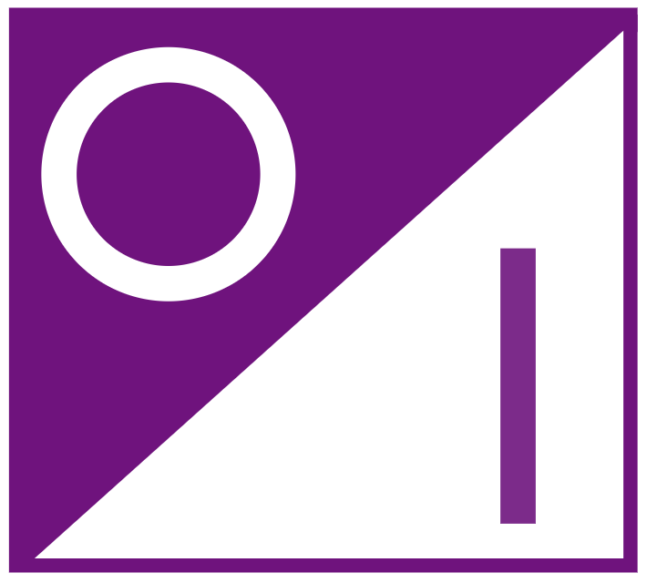

<h1>JFlepp.Maybe</h1>

A `Maybe` type for C#, aimed as an idiomatic port of the `option` type in F# to C#.

An option type is a type that has two states, `Some` and `None`. You can use it instead of `null` values as it forces
you to check if a value exists before using it. It also allows you to to enter an elevated world of having a value
or not (reader monads).

An easy way to think about option types is as lists with one item or none. This library provides you with such a type and with
C# idiomatic extensions as you would find them in `System.Linq`.

Take a look the the [Microsoft Docs](https://docs.microsoft.com/en-us/dotnet/fsharp/language-reference/options) for more informations about the option type this library aims to provide.

## Usage

Here is a Hello World example for the maybe library. 

~~~ cs
var aValue = Maybe.Some("Hello ")
	.Select(v => v + "World!");

void WriteIfIsSome(Maybe<string> option) => option.ForEach(Console.WriteLine);

WriteIfIsSome(aValue);

// Hello World!
~~~

Take a look at the [examples](docs/examples.md), [API](docs/API.md) or [special cases](docs/SpecialCases.md) docs for more information.

## Contributing

Feel free to open issues and PRs!

__Developing__

You can develop this library using Visual Studio 2019. Simply open the `JFlepp.Maybe.sln` in the root directory and you're good to go.

There is a CI pipeline set up that must pass before you can merge a PR. The pipeline checks for a code coverage of at least 99% percent and for 0 build warnings.

## QA

### There already are many implementations of the option type in C# available. Why another one?

There are many other implementations around and all differentiate a little bit.
This implementation aims to implemented option methods in an C# idiomatic (mainly `System.Linq` like) way
and doing so in a straight forward manner.

### How does versioning work?

This library uses [SemVer](http://semver.org/) for versioning.

### How do I access the value of a `Maybe`?

If possible, try to stay in the elevated world of maybes. Do not try to get the actual value out
of a maybe until you actually need it, but let it be a part of your domain model instead. Try to use the
numerous extension methods provided on the maybe if possible while doing so.

Nevertheless, there is an extension method hidden inside another namespace that allows direct value access

~~~ cs
namespace JFlepp.Functional.Unsafe
{
    public static class MaybeExtensions
    {
        public static T GetValue<T>(this Maybe<T> maybe);
    }
}
~~~

## References

- [FSharp on MSDN](https://msdn.microsoft.com/visualfsharpdocs/conceptual/core.option-module-%5Bfsharp%5D?f=255&MSPPError=-2147217396)
- [FSharp.Core](https://www.nuget.org/packages/FSharp.Core/)
